  <!-- Animated Custom Banner -->
  

 

<!-- 
  Animated Rotating Dotted Globe (Runs natively on GitHub!) 
  Floats to the right of the About Me section
-->

## 🚀 About Me
I am a backend-focused Computer Science undergraduate with hands-on experience designing production-pattern REST APIs using **Spring Boot** and **Java**. I focus on building layered, maintainable systems with clean separation of concerns, input validation, and centralized exception handling.

*   🎓 **Education:** Bachelor of Technology in Computer Science Engineering at **Galgotias University** (2022 — 2026) | CGPA: **8.6/10**
*   ⚡ **Engineering Philosophy:** Solve hard problems at scale — don't just write code that works, but code that lasts. I'm comfortable across the full stack (MERN) but excel at backend architecture and database modeling.

 

---

## ⚡ Connect with Me

  
  
  

---

## 🛠️ Technical Toolbox

I maintain a clean, organized workspace. My badges are styled with a uniform dark slate background to prevent visual clutter while preserving brand colors:

### ☕ Programming Languages

  
  
  
  

### ⚙️ Backend &amp; Architecture

  
  
  
  
  

### 💾 Databases &amp; Storage

  
  
  

### 🔧 Tools &amp; Environment

  
  
  
  
  

---

## 📁 Projects Showroom

Here is a look at the production patterns I implement in my personal projects:

### 🛠️ Blog Service REST API
> **Spring Boot, Java, JPA, MySQL**
*   **Architecture**: Designed a clean **4-layer architecture** (Controller, Service, Repository, DTO) enforcing strict separation of concerns.
*   **Input Integrity**: Built request-level DTO validation using `@NotBlank` and `@Size` constraints, intercepting violations to return standardized, client-friendly 4-field JSON error bodies.
*   **Database Modeling**: Configured a one-to-many relationship using JPA `@ElementCollection` across a 2-table schema, avoiding manual N+1 queries.
*   **Centralized Exception Handling**: Implemented a global exception handler using `@RestControllerAdvice` to map errors to uniform HTTP statuses (400, 404, 204).
*   <a href="https://github.com/rahulraj-rrj" target="_blank">🔗 View Repository</a>

### 📞 Contact Submission System
> **React, Node.js, Express, MongoDB**
*   **Backend Validation**: Built RESTful CRUD endpoints enforcing schema-level validation in MongoDB using Mongoose, with email uniqueness constraints to prevent duplicate entries.
*   **Frontend Layout**: Structured a single-page React frontend using custom modular components, utilizing Flowbite UI and Tailwind CSS for responsive presentation.
*   **State Management**: Structured unified state hooks to coordinate real-time CRUD operations seamlessly across all components.
*   <a href="https://github.com/rahulraj-rrj" target="_blank">🔗 View Repository</a>

---

## 📊 GitHub Analytics

### Unified Performance Cards
These stats update dynamically based on my GitHub activity and are themed to match my profile's neon-indigo/cyan dark mode:

  
  

  

### 🚀 Dynamic GitHub Metrics (Lowlighter Metrics)
Once setup, this section displays deep visualizations from the `lowlighter/metrics` GitHub Action, including achievements and advanced coding stats.

<!-- 
  NOTE: This image references the svg generated by your GitHub Actions workflow.
  It will show up as a broken link until you complete the quick setup guide below!
-->

  

 

  
<b>🛠️ Click to Expand: Quick Setup Guide for lowlighter/metrics</b>

  
  To activate the advanced **lowlighter/metrics** infographic card (`github-metrics.svg`):
  
  1. **Generate a Personal Access Token (PAT):**
     - Go to your GitHub account settings **Settings -> Developer Settings -> Personal Access Tokens -> Tokens (classic)**.
     - Click **Generate new token**.
     - Give it a description like `GitHub Metrics Token`.
     - Select the following scopes:
       - `repo` (all scopes)
       - `read:org`
       - `read:user`
     - Click **Generate token** and copy it immediately.
  
  2. **Add the Token to Repository Secrets:**
     - Go to your special profile repository settings (`rahulraj-rrj/rahulraj-rrj`).
     - Navigate to **Settings -> Secrets and variables -> Actions**.
     - Click **New repository secret**.
     - Name it `METRICS_TOKEN`.
     - Paste your copied token into the value box and save.
  
  3. **Run the Action:**
     - Go to the **Actions** tab of your repository.
     - Click on **Generate GitHub Metrics** in the left sidebar.
     - Click the **Run workflow** dropdown and select the main branch, then click **Run workflow**.
     - Once it completes (takes ~1-2 minutes), it will generate and commit a new file `github-metrics.svg` into your repository.
     - The README will automatically load and display your metrics.

